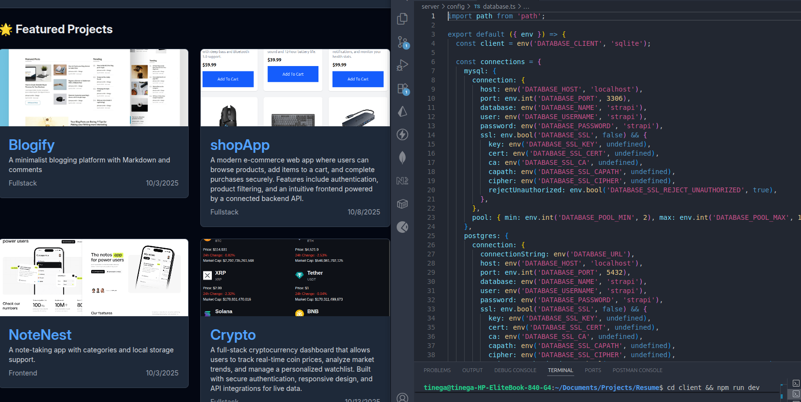

# 🧑‍💻 Resume App

A full-stack web application built with **React (Vite)** on the frontend and **Node.js (Express)** on the backend.  
The app is designed to showcase personal projects, skills, and experiences — with a modern UI and clean architecture.

---


## 🌐 Live Demo

- **Frontend (Client)** → https://portfolio-pi-pink-8zvm423hp8.vercel.app/
- **Backend (Server API)** → Backend (Server API) → https://portfolio-f9nx.onrender.com

---

## 🧠 Tech Stack

### Frontend
- ⚛️ **React (Vite)**
- 🧱 **Tailwind CSS**
- 🔄 **Axios** for API requests
- 🔐 Environment variables via `VITE_` prefix

### Backend
- 🚀 **Node.js** + **Express**
- 🗄️ **MongoDB (Mongoose)**
- 🔐 **JWT Authentication**
- ☁️ **Render** for deployment

---

## ⚙️ Project Setup

### 1️⃣ Clone the repository
```bash
git clone https://github.com/tinegachris-o/Resume.git
cd Resume
